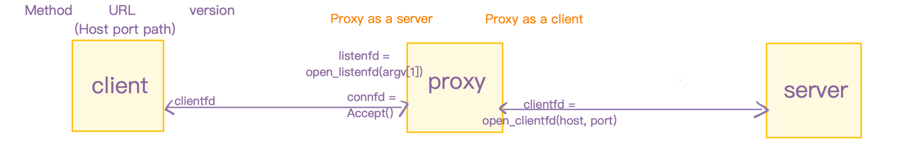

# Q

## 

This lab involves building a concurrent, multi-threaded Web proxy server. Let’s break down the requirements and give you a clear plan (thread of execution and design).



---

### 🔧 Part 1: Basic Proxy Functionality

#### 🎯 Goals:

1. **Accept connections from a browser.**
2. **Parse HTTP requests (GET method).**
3. **Forward requests to the actual web server.**
4. **Send the server’s response back to the browser.**
5. **Log each request’s URL to a file.**
6. **Block any URL that appears in a filter file (e.g., `filter.txt`).**

#### ✅ Step-by-step:

1. **Listening Socket Setup**

   * Use `Open_listenfd` to listen for browser requests on a specified port.

2. **Accepting a Client Request**

   * Use `Accept` to get the client file descriptor.

3. **Parse the HTTP request**

   * Read request line using `Rio_readlineb`.
   * Extract method, URI, and HTTP version from it.
   * Parse the URI to get:

     * Hostname (e.g., `www.google.com`)
     * Port (default: 80)
     * Path (`/index.html`)

4. **Check URL against filter list**

   * Load the `filter.txt` file into memory at startup or each time.
   * Block if the URL (host/path combo) matches any entry.

5. **Forward request to server**

   * Open connection to remote server with `Open_clientfd`.
   * Send request line and headers to the server.
   * Read response from server and forward it back to the browser.

6. **Logging**

   * Append the accessed URL to a `proxy.log` file (with timestamp and possibly client IP).

---

### 🧵 Part 2: Multithreading (Concurrency)

#### 🎯 Goals:

* Support multiple simultaneous connections using threads.
* Each thread handles one client request.

#### ✅ Steps:

1. **Thread Creation**

   * For each accepted connection, spawn a new thread.
   * Pass the accepted `connfd` to the thread via `malloc` and cast to `void *`.

2. **Thread Function**

   * Each thread:

     * Detaches itself (`Pthread_detach`)
     * Handles the full lifecycle: parse, filter, forward, respond, log, close.

3. **Thread Safety**

   * Use a `mutex` to protect access to shared resources:

     * `proxy.log`
     * Blocklist (if modified at runtime)

---

### 📦 Files and Data Flow

```plaintext
Browser ----> Proxy ----> Server
         <----       <----

Filter file: contains lines like "facebook.com", "/ads"
Log file:   each line is a log entry like:
    "Tue Jun 25 13:00:01 2025: GET http://example.com/index.html"
```

---

### 🧪 Testing

* Use:

  ```bash
  curl -v -x localhost:<port> http://example.com/
  curl -v -x localhost:5050 http://localhost:8000/
  ```

* Or set browser proxy settings.
* Check blocked URLs, correct forwarding, and logging.

#### TEST FOR PART 1

To **test your proxy code** (`simple_proxy.c` in your canvas), follow these **step-by-step instructions**. This will confirm that the proxy properly handles HTTP requests, blocks filtered URLs, and logs correctly.

---

✅ 1. **Compile your proxy**

```bash
gcc -o proxy simple_proxy.c csapp.c -pthread
```

Ensure `csapp.c` and `csapp.h` are present and correctly implemented in your directory (this is from the CS\:APP book).

---

✅ 2. **Start a backend HTTP server** (something to proxy to)

In a **separate terminal**, run:

```bash
python3 -m http.server 8000
```

This creates a simple HTTP server on port `8000`. It serves files from the current directory.

---

✅ 3. **Run your proxy**

In your original terminal:

```bash
./proxy
```

This starts your proxy on port 5000.

---

✅ 4. **Test with `curl`**

Now use `curl` to send requests *through your proxy* to the Python server:

```bash
curl -x localhost:5050 http://localhost:8000
```

> `-x` specifies a proxy to use.

You should see the directory listing or file served by the Python server. Your proxy should:

* Parse the URI
* Forward the request
* Receive the response
* Log the request in `proxy.log`

**What Happened:**

The proxy accepted the request from `curl`, parsed the URL, connected to `localhost:8000`, forwarded the request, and sent back the response — which happens to be a **directory listing** (the default behavior of `python3 -m http.server 8000` if you don't have an `index.html` file in the current directory).

---

✅ 5. **Add a blocklist and test**

Create a file `filter.txt`:

```txt
google.com
blockedsite.com
```

Then try:

```bash
curl -x localhost:5000 http://google.com
```

Your proxy should now return a 403 Forbidden response, because `google.com` is in the blocklist.

---

✅ 6. **Test with ApacheBench (`ab`)**

Install if not available:

```bash
brew install httpd   # macOS
sudo apt install apache2-utils   # Ubuntu/Debian
```

Then run:

```bash
ab -X localhost:5050 -n 100 -c 10 http://localhost:8000/
```

This sends 100 requests through the proxy to your Python server and reports performance stats.

- `ab` = ApacheBench, a load testing tool
- `-X localhost:5050` = use `localhost:5050` as a proxy
- `http://localhost:8000/` = test backend server (Python HTTP server)

---

🧪 What to Verify

* ✅ You get expected responses when accessing unblocked sites.
* ✅ Blocked URLs return a 403.
* ✅ `proxy.log` logs the requested URIs.
* ✅ Performance is reasonable under load.

---

#### TEST FOR PART 2
✅ 1. **Compile your proxy**

```bash
gcc -o proxy-thread proxy-thread.c csapp.c -pthread
```

Ensure `csapp.c` and `csapp.h` are present and correctly implemented in your directory (this is from the CS\:APP book).

---

✅ 2. **Start a backend threaded HTTP server** (something to proxy to)

In a **separate terminal**, run:

```bash
gunicorn -w 4 -b localhost:8000 app:app
```

This creates a simple concurrent HTTP server on port `8000`. It serves files from the current directory.

---

✅ 3. **Run your proxy**

In your original terminal:

```bash
./proxy-thread
```

This starts your proxy on port 5000.

---

✅ 4. **Test with `ab`**

Now use `curl` to send requests *through your proxy* to the Python server:

```bash
ab -n 100 -c 10 -X localhost:5050 http://localhost:8000/
```

---

### why do we need parse the uri, why can we not redirect the requeset to the server?

Great question.

We **parse the URI** in a proxy server because the browser sends a full **HTTP request with the URI**, but the server we're forwarding the request to expects a **relative path**, not a full URI.

---

**🔍 Why we *must* parse the URI**

When your browser sends a request through a proxy, the request line looks like this:

```c
GET http://www.example.com/index.html HTTP/1.1
```

But when you connect directly to `www.example.com`, the server expects only the **path** portion:

```c
GET /index.html HTTP/1.1
```

If you forwarded the request unchanged, the remote server would reject or mishandle it.

---

**📦 What we extract by parsing the URI**

From the URI like:

```c
http://www.example.com:8080/index.html
```

We parse:

* **Host**: `www.example.com`
* **Port**: `8080` (or default `80` if not specified)
* **Path**: `/index.html`

These are used to:

1. Open a TCP connection to `www.example.com` on port `8080`.
2. Send a correctly formatted HTTP request:

   ```http
   GET /index.html HTTP/1.0
   Host: www.example.com
   Connection: close
   ```

---

**🔧 Why not just redirect the raw URI?**

You *can't* "redirect" an open socket connection. Redirects are handled via HTTP responses (`3xx` codes), not at the TCP level. A proxy must behave like a **man-in-the-middle**, reading the client's request, understanding it, opening a new connection to the target server, and rewriting the request appropriately.

---

**✅ Summary**

| Task            | Why necessary                      |
| --------------- | ---------------------------------- |
| Parse URI       | To extract host, port, and path    |
| Rewrite request | Server only accepts relative paths |
| Forward request | Need correct format for server     |

Let me know if you'd like to see an example of a raw request and how it's rewritten!


### You can't assign arrays directly in C — you must use strcpy (or strncpy)

this part of code in `parse_uri`  

```c
    } else if (slash) {
        *slash = '\0';
        sscanf(pos, "%s", host);
        *slash = '/';
        strcpy(path, slash);
    } 
```

can not replace with

```c
   } else if (slash) {  // pos = "example.com/index.html"
      *slash = '\0';
      host = pos;
      path = slash + 1;
   }
```

**because**

- `host` and `path` are typically defined as arrays (char host[MAXLINE], char path[MAXLINE]), not pointers.

- So assigning them like host = pos; and path = slash + 1; causes a compile-time error: "assignment to expression with array type"

**correct version**
If you want to simplify, you can use `strcpy` instead:

```c
} else if (slash) {
    *slash = '\0';              // Temporarily terminate host string
    strcpy(host, pos);          // Copy host part
    *slash = '/';               // Restore slash
    strcpy(path, slash);        // Copy path part (including '/')
}
```

**why not assign directly?**

Because `host` and `path` are declared as arrays, **you can't assign arrays directly in C** — you must use `strcpy` (or `strncpy`).

If you had declared them as `char *host;` and `char *path;` and allocated memory manually (e.g., with `malloc`), then your version would be legal — but you'd have to manage memory yourself.

### Why not use `Rio_writen(connfd, buf, strlen(buf))` but `Rio_writen(connfd, buf, n)`?

> short answer: `strlen(buf)` only works if `buf` is a null-terminated string. 
```c
/* read response from server and forward it back to the browser*/
while ((n = Rio_readlineb(&server_rio, buf, MAXBUF)) > 0) {
    Rio_writen(connfd, buf, n);
}
```

can not be replacement by

```c
while ((n = Rio_readlineb(&server_rio, buf, MAXBUF)) > 0) {
    Rio_writen(connfd, buf, strlen(buf));
}
```

**Explanation line-by-line:**

1. **`while ((n = Rio_readlineb(&server_rio, buf, MAXBUF)) > 0)`**

   * This line reads one line at a time from the `serverfd` (the file descriptor connected to the target server).
   * `Rio_readlineb` reads up to `MAXBUF` bytes or until a newline is encountered.
   * It returns the number of bytes read (`n`), or 0 if EOF (end of file) is reached.
   * The loop continues as long as the server keeps sending data (i.e., response body or headers).

2. **`Rio_writen(connfd, buf, n);`**

   * This sends the line just read from the server to the client via `connfd`.
   * `Rio_writen` ensures that exactly `n` bytes are written, even if the write is interrupted or partially completed by the kernel.

---

**Why not use `Rio_writen(connfd, buf, strlen(buf))`?**

Because `buf` might contain binary data or data with embedded null bytes (`\0`), or it might not be null-terminated at all. `strlen(buf)` only works if `buf` is a null-terminated string. But the proxy is handling raw HTTP responses, which may not be null-terminated. That's why we use `n`, the exact number of bytes returned by `Rio_readlineb`.


### FIXED THREAD VERSION when occur `Rio_readlineb error: Connection reset by peer`

You're seeing a `BrokenPipeError` on your Python HTTP server (`python3 -m http.server 8000`) because your proxy server (the client from the Python server’s perspective) **is closing the connection prematurely** — likely **before the server is done writing the response**.

---

#### ✅ Summary of What's Happening

You're testing your proxy with:

```bash
ab -X localhost:5000 -n 100 -c 10 http://localhost:8000/
```

* `ab` = ApacheBench, a load testing tool
* `-X localhost:5000` = use `localhost:5000` as a proxy
* `http://localhost:8000/` = test backend server (Python HTTP server)

But the Python server crashes with:

```txt
BrokenPipeError: [Errno 32] Broken pipe
```

This happens when the **proxy closes the connection before the backend server finishes responding**.

---

#### 🔍 Root Cause in Your Proxy Code

In your proxy, you **always send these two headers**:

```c
sprintf(buf, "Connection: close\r\nProxy-Connection: close\r\n\r\n");
Rio_writen(serverfd, buf, strlen(buf));
```

This forces the server to close the connection after the response — **but** the proxy may **close the socket before fully reading or forwarding the response**, especially under load (e.g., `ab`’s concurrency).

Also, your proxy may not **read the entire response** (e.g., if response is chunked or longer than a few lines). This leads to:

* Server still writing
* Proxy closes the socket
* Python server gets a `BrokenPipeError`

---

#### ✅ How to Fix It

1. **Ensure your proxy reads the full response**, not just `readlineb()`.

Replace:

```c
while ((n = Rio_readlineb(&server_rio, buf, MAXBUF)) > 0)
```

With:

```c
while ((n = Rio_readnb(&server_rio, buf, MAXBUF)) > 0)
```

You’re currently using **line-based reading**, which breaks on binary data or long responses. Use `Rio_readnb()` for raw binary-safe reads instead.

2. **Set `Connection: close`** only if you actually plan to close the socket after forwarding the full response. In your case, that’s okay, but make sure to forward **all** the server’s data.

---

#### 🔁 In Summary

| Problem                            | Solution                                          |
| ---------------------------------- | ------------------------------------------------- |
| `BrokenPipeError` on Python server | Proxy closed connection before done               |
| `Rio_readlineb()` is not enough    | Use `Rio_readnb()` for complete responses         |
| High concurrency via `ab`          | Reveals race/timing bugs — test with `curl` first |
| SIGPIPE crash (optional)           | Ignore `SIGPIPE` with `Signal(SIGPIPE, SIG_IGN)`  |

#### ? Why is the use of readlineb not affected by the server response in the non-thread version with two tests (curl and ab) and the thread version with curl?

 You're asking why this version of the proxy (non-threaded or single-threaded) **does not fail** using `Rio_readlineb` to forward server responses — even when:

* `curl` works for both thread and non-thread versions,
* `ab` (ApacheBench) fails only in the **threaded version** with `Rio_readlineb`,
* And the non-threaded version seems immune.

---

##### ✅ Here's a precise technical breakdown:

###### 🔹 1. `Rio_readlineb` only reads until it hits `\r\n`

This function is **line-buffered**, and will **not** read binary data or long continuous chunks properly (e.g., images, HTML bodies).

* It's fine for **reading headers**, which are text lines ending in `\r\n`.
* It’s **not reliable** for reading the body of a response, especially when:

  * The server sends content with **`Content-Length`** or **chunked transfer encoding**.
  * The proxy is expected to forward the **entire body**.

---

###### 🔹 2. Why the non-threaded version works (sometimes):

This is **due to timing and serialization**:

* In the non-threaded version:

  * There is **only one active client request at a time**.
  * The proxy waits for the full response from the server (headers + body), even if it’s using `Rio_readlineb`.

Because the server (like `http.server`) usually sends short files, the response **might be entirely buffered** and fit within one or a few lines — **so `readlineb` accidentally works.**

> It's not correct, but it doesn't break due to the slow, serialized nature of single-threaded processing.

---

###### 🔹 3. Why the threaded version fails with `Rio_readlineb`

In your thread-pool version:

* Multiple threads read/write concurrently.
* If one thread closes the connection early (e.g., it finishes `readlineb` after headers), the server might still be writing the body.
* The server then tries to `send()` to a closed socket → **BrokenPipeError**.

In short, **concurrency exposes the fragility** of using `readlineb` incorrectly for reading response bodies.

---

###### 🔹 4. Why `curl` works even in the thread version

* `curl` sends just **one request** and reads the full response.
* The server closes cleanly, and your proxy isn’t overwhelmed.
* Again: you're **lucky** the data fits in the expected buffer and timing works out.

But with `ab`:

* Many concurrent requests cause race conditions.
* `readlineb` exits too early → the proxy closes the socket → the server still tries to write = 💥 Broken pipe.

---

##### ✅ Summary: Why it behaves this way

| Case                 | Threads | Tool   | Uses `readlineb` | Breaks? | Why                   |
| -------------------- | ------- | ------ | ---------------- | ------- | --------------------- |
| Non-threaded version | ❌       | `curl` | ✅                | ❌       | Only 1 request, lucky |
| Non-threaded version | ❌       | `ab`   | ✅                | ❌       | Serialized, slow      |
| Threaded version     | ✅       | `curl` | ✅                | ❌       | Timing okay           |
| Threaded version     | ✅       | `ab`   | ✅                | ✅       | Parallel, racey close |

---

##### ✅ Fix Recap

Use this in your **proxy thread handler**:

```c
ssize_t n;
char buf[MAXBUF];
while ((n = Rio_readnb(&server_rio, buf, MAXBUF)) > 0) {
    Rio_writen(connfd, buf, n);
}
```

* Reads all data including binary content.
* Prevents early socket closure.
* Works robustly with concurrency and streaming content.

---

### EVEN USING Rio_readnb it still occur `Rio_readnb error: Connection reset by peer` or 'connection reject' error

I add debug printf around rio_readnb to locate the wrong code.

```c
// read response from server and forward it back to the browser
Rio_readinitb(&client_rio, clientfd);
printf("1. before read response from server and forward. tid %ld\n", tid); fflush(stdout);
    while ((n = Rio_readnb(&client_rio, buf, MAXLINE)) != 0) {
        printf("2. read response from server and forward it back to the browser. tid %ld: %s", tid, buf); fflush(stdout);
        Rio_writen(connfd, buf, n);
    }
```

and I found only one thread print `2. read response from server and forward it back to the browser. ` that means only one proxy received server reply, others are blocked at ` while ((n = Rio_readnb(&client_rio, buf, MAXLINE)) != 0) `

This is an **important breakthrough** — let’s break down exactly what it means and how to fix it.

---
#### ✅ What That Means

Your proxy **successfully connects to the destination server**, but:

* Only **one thread receives the full HTTP response** from the server.
* All other threads either:

  * **block forever** on reading the server response (hung `read()`), or
  * **receive nothing**, i.e., `read() == 0`.

This **strongly suggests the server is closing connections immediately for some of your threads**.

---

#### 🔥 Root Cause: Python HTTP Server is **Single-Threaded by Default**

You're using:

```bash
python3 -m http.server 8000
```

This command starts a **simple, synchronous, single-threaded** HTTP server. It:

* Handles **only one connection at a time**.
* Does **not support concurrent requests**.
* When overloaded (via `ab -c 10`), it often **accepts then immediately closes** most connections → resulting in:

  * `Connection reset by peer` in your proxy
  * `read() == 0` or blocked reads

---

#### ✅ Solution

(wrong version)
first, you tried python version threaded server because `python3 -m http.server 8000` only can deal with single thread problem, but we still have probelms

##### Let's summarize the facts(problem):

* ✅ `curl http://localhost:8080/` works → the server **is listening** and responds to simple requests.
* ❌ `ab -n 100 -c 10 -X localhost:5050 http://localhost:8080/` fails with `Connection refused (61)` but `ab -n 100 -c 2 -X localhost:5050 http://localhost:8080/` or less thread worked
* ✅ You're running a Python threaded server (`threaded_server.py`)
* ❗ Server crashes/stops responding after a few `ab` tests

---

##### 🧠 Explanation

Your **Python threaded HTTP server** is likely **not scaling well** under the rapid-fire connections from ApacheBench (`ab`). Here's what's happening:

##### ❌ `threaded_server.py` runs into limits

Your server may look like this(and run through `python3 threaded_server.py`):

```python
# threaded_server.py
from http.server import ThreadingHTTPServer, SimpleHTTPRequestHandler

PORT = 8000

httpd = ThreadingHTTPServer(('127.0.0.1', PORT), SimpleHTTPRequestHandler)
print(f"Serving on port {PORT} with threads")
httpd.serve_forever()
```

This starts a new thread for **each incoming request**. That works fine for `curl` and `ab -n 100 -c 2 http://localhost:8080/`, but not `ab -n 100 -c 10 http://localhost:8080/`:

1. ThreadingHTTPServer is not built for heavy concurrency.
   * At -c 10, ApacheBench opens 10 concurrent connections. If ThreadingHTTPServer isn't fast enough at spawning threads and accepting connections, connections are refused
   * The standard library's http.server is a teaching and demo server, not designed to handle 10+ concurrent connections reliably.
   * It lacks features like connection timeouts, socket reuse tuning, and connection queue depth.

2. TIME_WAIT socket exhaustion
   * Each connection goes through a TCP lifecycle: ESTABLISHED → FIN_WAIT → TIME_WAIT.
   * If you're reusing the same port (like 8080) over and over without a long wait, your OS may not allow new connections to that port — especially on loopback.
that's why:
   * It works one day.
   * But the next day (or after many test runs), it doesn’t — until you switch to port 8080.

   **You’re hitting port binding exhaustion or TCP backlog overflow.**

3. Small listen backlog
   * Python’s ThreadingHTTPServer is built on socketserver.TCPServer, which sets a small default backlog (usually 5).
   * So only a few connections can be waiting to be accepted at once.
  
   10 concurrent connections hit it hard and get refused.

---

##### ✅ What you can do

let’s get you a **stable test server** that handles concurrent `ab` benchmarks without crashing.

---

###### ✅ Option A: Use Python + `gunicorn` (Fast, Easy, we choose this)

You can keep using Python, but with **Gunicorn**, a WSGI server built for concurrency.

 1⃣️ **Install `gunicorn`**

```bash
pip3 install gunicorn
```

---

2⃣️ **Create a simple `app.py`**

```python
# app.py
def app(environ, start_response):
    response_body = b"Hello from Gunicorn!\n"
    status = '200 OK'
    headers = [('Content-Type', 'text/plain'), ('Content-Length', str(len(response_body)))]
    start_response(status, headers)
    return [response_body]
```

This is a **WSGI (Web Server Gateway Interface)** application — the standard interface between web servers (like **Gunicorn**) and Python web apps.

Gunicorn expects this kind of` app(environ, start_response)` function.

`def app(environ, start_response):`

* Defines a WSGI application callable named `app`

* `environ`: a Python `dict` with **request info** (URL, method, headers, etc.)

* `start_response`: a function you call to **start the HTTP response**, including status and headers

`body = b"Hello from Gunicorn!\n"`

* This is the **response body**, as a `bytes` object (`b""`).

* WSGI requires the response to be bytes, not a string.

`headers = [("Content-Type", "text/plain"), ("Content-Length", str(len(body)))]`

* HTTP response headers:

  * `Content-Type`: tells the client this is plain text.

  * `Content-Length`: tells the client how many bytes to expect (important for persistent connections or proxies).

  * `str(len(body))` ensures the length (an int) is converted to a string, as required.

`start_response("200 OK", headers)`

* This tells the WSGI server (Gunicorn) to:

  * Start the response

  * Use HTTP status `200 OK`

  * Send the listed headers

`return [body]`

* The body is returned as a **list of bytes**.

* You can return multiple chunks, but here it’s just one.

The client receives:

```c
HTTP/1.1 200 OK
Content-Type: text/plain
Content-Length: 21

Hello from Gunicorn!
```

---

 3⃣️ **Start gunicorn with multiple workers**

```bash
gunicorn -w 4 -b localhost:8080 app:app
```

That means:

* `-w 4` = Run 4 worker processes (can handle 4 requests concurrently)

* `-b` = Bind to a socket (port 8080)

* `app:app` = Run the WSGI app in app.py

---

 4⃣️ **Test**

Try:

```bash
curl http://localhost:8080/
```

Then:

```bash
ab -n 100 -c 10 -X localhost:5050 http://localhost:8080/
```

This work reliably.

---

###### ✅ Option B: Use Nginx via Docker (Best performance)

If you want a *real web server*, you can run Nginx with Docker.

1⃣️ **Start Nginx serving your current directory**

```bash
docker run --rm -p 8080:80 -v $(pwd):/usr/share/nginx/html:ro nginx
```

* Serves files from your current dir
* Read-only bind (`:ro`)
* Port `8080` exposed

2⃣️ **Test**

```bash
curl http://localhost:8080/
ab -n 100 -c 10 -X localhost:5050 http://localhost:8080/
```

---

###### ✅ Option C: Node.js (if installed)

If you have Node.js, you can run:

```bash
npx http-server -p 8080
```

Or install it globally:

```bash
npm install -g http-server
http-server -p 8080
```

---

##### 🔚 Summary

| Option | Tool                    | Best for                           |
| ------ | ----------------------- | ---------------------------------- |
| A      | `gunicorn`              | Lightweight Python-based responses |
| B      | `nginx` via Docker      | High-performance file serving      |
| C      | `http-server` (Node.js) | Easy static server                 |


---

#### ✅ Confirm with this test

Try:

```bash
ab -n 100 -c 10 http://127.0.0.1:8080/
```

**Skip the proxy** for now.

If that fails — the **server is the problem**, not your proxy.

---

#### ✅ TL;DR

| Issue                     | Explanation                                                 |
| ------------------------- | ----------------------------------------------------------- |
| `curl` works, `ab` fails  | `ab` overwhelms your lightweight Python threaded server     |
| `Connection refused (61)` | Your server temporarily refuses connections under high load |           |
| Proxy not to blame        | The backend server is the bottleneck here                   |

---


#### ✅ Why Your Proxy is Likely Correct

Your proxy:

* Parses requests correctly
* Forwards headers correctly
* Logs and threads properly
* Reads response fully (as seen in one working thread)
* Test without using proxy `ab -n 100 -c 10 http://127.0.0.1:8080/`
, it also report error

The problem is not your code anymore — it’s the **server implementation being overloaded**.

---

#### 💡 Summary

| Symptom                               | Cause                                     | Fix                                       |
| ------------------------------------- | ----------------------------------------- | ----------------------------------------- |
| Works with `-c 2`, fails with `-c 10` | Low backlog, server can’t accept 10 conns | Increase backlog or use real server       |
| Works one day, fails the next         | TIME\_WAIT, socket exhaustion             | Use new port or wait or set SO\_REUSEADDR |
| Gunicorn works better                 | It’s built for concurrency                | Prefer it over `http.server` for tests    |

---

### fopen file write on mutilple threads is okay? don't need any protect like P or V operations?

- if a file only be read by threads not written, it no need to using mutex to protect.

- but a file is be written in thread, it must be using mutex to protect. like log file in this proxy-thread

